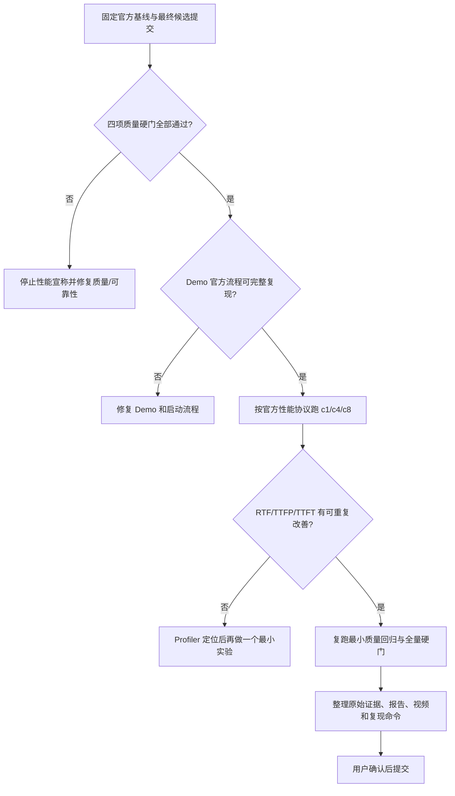

# MiniCPM-o 4.5 昇腾赛道完整信息汇总、规则与实验账本

> 更新时间：2026-08-21（Asia/Shanghai）  
> 用途：集中记录比赛规则、目标、代码谱系、运行环境、全部已知实验、质量与性能结果、失败方向、证据强度、研究判断和未决问题。  
> 当前主任务：Track 1 / vLLM-Omni / MiniCPM-o 4.5 / 单张物理 Ascend 910C 推理优化。  
> 内容边界：本文按事实、证据和实验谱系组织；任何结论都应能追溯到规则、提交、实验制度或原始结果。

本仓库的数据组织：

- `main`：当前这份完整信息汇总，是整个项目的统一入口。
- `historical-evidence`：487 个历史源码、配置、原始 JSON、stdout、资源采集结果、实验 001–010 和报告文件。
- 最新 vLLM-Omni 候选源码：[`bbbkawaii/vllm-omni@4908de00`](https://github.com/bbbkawaii/vllm-omni/tree/codex/minicpm-challenge-20260820)。

---

## 0. 核心事实与当前状态

1. **当前真正的最终候选源码不在本地协调仓库的 `main` 中。**
   - 历史协调/实验仓库：`https://github.com/bbbkawaii/minicpm-o-ascend-context/tree/historical-evidence`
   - 本地 `main` 当前提交：`fbb75e0 docs(track1): record rejected 910c boundary sweep`
   - 这个仓库保存 2026-08-07 至 2026-08-11 的基线、实验 001–010、测试工具、报告和拒绝记录。
   - 2026-08-20 至 2026-08-21 的最终候选直接在远端 910C 上基于官方 vLLM-Omni 分支开发，尚未回填到这个协调仓库。

2. **最新候选的可获取源码已经推送到个人 fork。**
   - 上游仓库：`https://github.com/vllm-project/vllm-omni`
   - 官方比赛基线分支：`minicpm-challenge`
   - 已确认基线提交：`4105c717fe9fdab70285f4d23036768b7814ba78`
   - 候选分支：`codex/minicpm-challenge-20260820`
   - 候选提交：`4908de0044e3d08044c86659ca1743d4e847b147`
   - fork 分支：`https://github.com/bbbkawaii/vllm-omni/tree/codex/minicpm-challenge-20260820`
   - 2026-08-21 本次核验：远端分支仍指向 `4908de00`。
   - 2026-08-21 本次核验：该分支**没有上游 PR**。
   - 它已推送到 fork，但**尚不能称为官方提交，也没有官方榜单成绩**。

3. **最终候选通过了 Seed-TTS 和 Video-MME 的已完成质量验证，但最终源码的 Daily-Omni 全量复测尚未取得结果。**
   - Seed-TTS WER：`1.0363%`，2020/2020，0 请求/PCM/ASR 失败，门槛 `≤1.56%`，通过。
   - Seed-TTS ASV SIM：`0.710264`，2020/2020，门槛 `≥0.689`，通过。
   - Video-MME：`1876/2700 = 69.48%`，2700/2700 请求成功，门槛 `≥67.0%`，通过。
   - 历史候选 Daily-Omni：`934/1197 = 78.028%`，1197/1197 请求成功，2 个答案解析失败；高于 `77.5%`，但只比内部 `78%` 目标多约 1 题，余量非常薄。
   - 最终提交 `4908de00` 的 Daily-Omni 全量复测曾启动；最后确认进度为 23/1197、服务健康、无已见错误，但未拿到完整 `result.json`。
   - 2026-08-21 本次尝试通过 SSH 刷新状态时，连接在 banner exchange 阶段超时。因此本文只能把它标记为**待确认**，不能把历史 78.028% 冒充成最终源码结果。

4. **当前性能不是已获胜状态。**
   - 官方参考 c1 RTF：`0.4423`。
   - 最终候选目前最可比的 c1 结果：冷态约 `0.63`，暖态 `0.50434`，最终一次暖态/缓存淘汰后 `0.51067`。
   - `0.51067` 比 `0.4423` 慢约 15.5%。
   - c4 首轮 `1.60934`，比官方 `1.5734` 慢约 2.3%。
   - c8 `2.43115`，比官方 `2.3024` 慢约 5.6%，但比最终候选此前的 `2.61743` 好约 7.1%。
   - 某些 cache-warm 结果很好，例如 c4 `1.21826`，但它不是公平的官方首轮对比，**只能用于定位，不可当成绩**。

5. **当前最紧急的硬门不是继续盲目优化，而是拿到最终源码 Daily-Omni 的完整结果。**
   - 若 `4908de00` 的 Daily-Omni 不能做到 1197/1197 请求完成、0 请求失败且准确率 `≥77.5%`，当前候选不能进入性能排名。
   - 内部建议仍使用 `≥78.0%` 作为更稳妥门槛，因为 77.5% 附近只有几题余量。

6. **所有分数必须保留测试口径。**
   - 双卡自定义文本测试、单卡官方英语 Seed-TTS 性能、单卡中文 c1 A/B、质量 WER/ASV、榜单成绩是不同制度，不能直接混比。
   - 尤其不能把中文 c1 候选 `RTF 0.440386` 与官方英语 c1 `0.4423` 直接比较后宣称领先。

7. **不要重复已经被明确否决的方向。**
   - Stage2 `max_num_seqs=7/8`
   - Stage0 `max_num_seqs=6`
   - Token2Wav 4 steps
   - Token2Wav FP16
   - codec left context 2
   - codec chunk 32
   - Stage1 `max_num_seqs=5`
   - 初始 codec 10 / steady 25 或 32 的旧实现
   - prompt/Flow/CFM 初始状态 LRU size 2
   - “只向 Talker 传参考音频”的版本
   - 上述方向若无新的代码机制、官方协议变化或 profiler 证据，不应重新消耗卡时。

---

## 1. 任务范围、比赛目标与成功定义

### 1.1 当前范围

仓库包含两个严格独立的项目：

| 项目 | 内容 | 当前状态 | 是否当前主任务 |
|---|---|---|---|
| Track 1 | MiniCPM-o 4.5 在 Ascend 910C 上的 vLLM-Omni 推理优化 | 已有大量真实 NPU 实验和最终候选 | **是** |
| Track 2 | Guardian-O 创新应用 | 有产品与架构设计，未形成可运行实现 | 否 |

Track 2 的功能开发、依赖或提交内容不应混入 Track 1 PR。相关架构边界见：

- [项目 Context Map](https://github.com/bbbkawaii/minicpm-o-ascend-context/blob/historical-evidence/CONTEXT-MAP.md)
- [独立赛道 ADR](https://github.com/bbbkawaii/minicpm-o-ascend-context/blob/historical-evidence/docs/adr/0001-independent-track-projects.md)
- [Track 1 Context](https://github.com/bbbkawaii/minicpm-o-ascend-context/blob/historical-evidence/track1-inference-optimization/CONTEXT.md)

### 1.2 比赛目标

本任务不是单纯“让代码更快”，而是同时满足以下四层目标：

1. **硬质量门全部通过**：Daily-Omni、Video-MME、Seed-TTS WER、Seed-TTS ASV SIM。
2. **Demo 可用**：文本、图片、音频、视频输入能够完成推理，并输出完整文本/音频；流式音频连续，服务不能明显卡死或退出。
3. **性能排名尽量高**：在官方单张 910C、官方镜像和官方脚本下优化 RTF、TTFP、TTFT；目前掌握的信息表明 RTF 优先级最高。
4. **可复现和可交付**：代码、配置、启动脚本、benchmark 脚本、原始结果、性能报告、Demo 说明/视频和复现说明齐全。

### 1.3 当前阶段的具体目标

按优先级排列：

1. 取得 `4908de00` 最终源码的 Daily-Omni 全量结果，确认硬门。
2. 在不破坏全部质量门和 Demo 的前提下，把官方英语 c1 RTF 从约 `0.51067` 降到至少优于 `0.4423`。
3. c1 改善后再检查 c4/c8，避免只优化单并发却损坏高并发。
4. 完成 Demo 录屏、提交说明、完整结果归档和复现材料。
5. 在获得用户明确授权后才做官方提交；创建 PR 或提交平台成绩都属于单独的外部动作。

### 1.4 成功判定



---

## 2. 证据层级与状态用语

### 2.1 证据优先级

出现冲突时，按下面顺序处理：

1. 当前官方比赛页面、官方 starter kit、官方评测分支中的可执行脚本和配置。
2. 组织者群内最新明确通知，尤其是硬门、截止时间、排行榜口径和卡时安排。
3. 官方仓库 `minicpm-challenge` 分支和指定提交。
4. 同一候选、同一数据、同一镜像、同一物理 910C 上保存的原始 `result.json`/日志。
5. 本地协调仓库的历史报告和已归档 JSON。
6. 记忆或口头总结，只用于定位，不代替当前验证。

### 2.2 本文状态标签

| 标签 | 含义 |
|---|---|
| 已核验当前 | 本次可以从 GitHub、本地仓库或当前页面重新确认 |
| 最后确认 | 先前有直接命令/日志证据，但本次无法重新连接对应机器 |
| 历史结果 | 对应旧提交或旧运行条件，不能当最终候选当前成绩 |
| 待确认 | 运行曾开始或信息存在冲突，但没有完整最终证据 |
| 已拒绝 | 有性能/质量证据支持不保留 |
| 仅诊断 | 能解释瓶颈，但测试条件不公平或不满足官方协议 |

### 2.3 禁止使用的模糊表述

- 不说“现在成绩是 78.028%”，而说“历史候选 Daily-Omni 为 78.028%；最终源码复测待确认”。
- 不说“当前已经提交”，而说“候选分支已推送到 fork；无上游 PR；未确认官方提交”。
- 不说“我们已超过官方基线”，除非测试语言、并发、样本数、warmup、代码提交和脚本完全一致。
- 不说“通过 WER”，除非说明数据规模是 64 个 targeted smoke、1088 英语，还是 2020 中文全量。
- 不说“0 失败”，除非同时检查请求、PCM、ASR、解析、音频连续性等对应失败字段。

---

## 3. 比赛要求与当前掌握的官方口径

### 3.1 官方赛道

- 比赛：MiniCPM & 昇腾推理优化与应用创新挑战赛。
- 当前任务：Track 1 推理优化，vLLM-Omni 子赛道 B，模型 MiniCPM-o 4.5。
- 统一硬件：一张物理 Ascend 910C。
- 官方镜像：`quay.io/ascend/vllm-omni:v0.25.0-a3`。
- 官方页面：<https://ascend.openbmb.cn/competition>
- 官方 vLLM-Omni 参赛 RFC：<https://github.com/vllm-project/vllm-omni/issues/5075>

### 3.2 时间线

截至 2026-08-21 可见信息：

| 事项 | 当前掌握日期 | 证据与注意事项 |
|---|---:|---|
| 报名开放 | 2026-07-13 | 官方首页时间线 |
| 提交开放 | 首页写 2026-07-22；赛道详情曾写 2026-08-07 12:00 | 存在页面口径差异，不影响当前已开放事实 |
| 报名截止 | 2026-08-14 | 官方首页时间线 |
| 提交截止 | 2026-08-31；群内最新观察为 12:00 CST | 提交前必须再次核验精确时刻 |
| 复现/评审与结果发布 | 2026-09-15 | 官方首页时间线 |
| 奖励时间 | 2026-10-01 | 官方首页时间线 |

[历史规则摘要](https://github.com/bbbkawaii/minicpm-o-ascend-context/blob/historical-evidence/docs/competition-rules.md) 的部分日期早于当前官方更新，只能作为历史材料，不能覆盖官方页面和群内最新通知。

### 3.3 质量硬门

组织者群内最新明确数值如下：

| 评测 | 硬门 | 方向 | 当前候选证据 |
|---|---:|---|---|
| Daily-Omni | `≥77.5%` | 越高越好 | 历史 78.028%；最终提交待确认 |
| Video-MME | `≥67.0%` | 越高越好 | 69.48%，通过 |
| Seed-TTS ASV SIM | `≥0.689` | 越高越好 | 0.710264，通过 |
| Seed-TTS WER | `≤1.56%` | 越低越好 | 1.0363%，通过 |

任一项不满足时，按当前掌握规则不会进入性能评分。

官方公共页面还使用“精度相对基线下降不超过 2 个百分点”等概括性表述；执行时应优先遵守更具体、更严格的四项数值硬门。

### 3.4 Demo 门

至少应证明：

- 模型服务能够从提交说明中的命令启动。
- 文本、图片、音频、视频输入均可用。
- 输出包含完整文本和音频。
- 流式音频连续，无明显中断、服务退出或长时间无响应。
- 官方流程可以从空环境按文档复现。
- 最终提供 Demo 启动脚本、使用说明和录屏。

当前最终分支内有零第三方 Python 依赖的 HTTP Demo，见第 10 节。它不等于全双工 WebSocket 示例已经通过。

### 3.5 性能指标

| 指标 | 含义 | 方向 | 当前作用 |
|---|---|---|---|
| RTF | 音频生成耗时相对生成音频时长的比例 | 越低越好 | 当前掌握规则中的首要排名指标 |
| TTFP | Time To First Packet，首个音频包延迟 | 越低越好 | 重要次级指标/并列判断 |
| TTFT | Time To First Token，首个文本 token 延迟 | 越低越好 | 次级指标/并列判断 |
| Throughput | 单位时间完成请求数 | 越高越好 | 诊断与报告指标，不应擅自替代官方主排序 |
| E2E | 请求端到端延迟 | 越低越好 | 诊断与体验指标 |

群内最新材料指向“RTF 优先，随后 TTFP、TTFT”的排序逻辑；提交前必须再核对最终评测说明，不能自行设计加权总分。

### 3.6 性能执行协议冲突

目前存在必须显式保留和处理的规则冲突：

- 一份后续文字说明被观察为“中文、单并发”性能口径。
- 后续拿到的可执行官方配置/测试文件明确覆盖英语 Seed-TTS：
  - c1：32 个正式请求
  - c4：64 个正式请求
  - c8：128 个正式请求
  - 每档 2 个 warmup（早期本地复现曾使用 3 个 warmup）
- 官方参考性能表也给出了 c1/c4/c8 三档。

处理原则：

1. 提交前重新拉取官方比赛分支和 starter kit。
2. 对比文字说明、入口脚本、配置文件、数据 locale 和 runner 实际参数。
3. 若仍冲突，向组织者确认；在确认前以**实际执行的官方脚本**作为工程基准。
4. 文档中同时保存“文字规则”和“执行规则”，禁止悄悄选择有利口径。

### 3.7 官方参考性能

最新拿到的官方参考值：

| 并发 | RTF | TTFT | TTFP | Throughput | E2E |
|---:|---:|---:|---:|---:|---:|
| c1 | 0.4423 | 333.26 ms | 986.47 ms | 0.5383 req/s | 1857.22 ms |
| c4 | 1.5734 | 533.87 ms | 3411.08 ms | 0.6042 req/s | 6600.51 ms |
| c8 | 2.3024 | 547.34 ms | 3352.75 ms | 0.7547 req/s | 10450.68 ms |

这些数值只能与完全相同的官方英语、样本、并发、warmup、镜像和统计方法比较。

### 3.8 最终交付物

至少包括：

- 修改后的代码与配置。
- 模型服务启动脚本。
- benchmark 脚本和数据准备说明。
- Demo 启动脚本、使用说明、录屏。
- Daily-Omni、Seed-TTS、Video-MME 的完整命令、原始输出和汇总。
- 性能报告：环境、数据、运行次数、统计方法、RTF/TTFP/TTFT、before/after、资源占用、异常说明。
- 瓶颈分析、优化方法、效果、适用范围、回退方式。
- 可复现说明。
- 若提交上游 PR，PR 必须范围小、保留 GPU 行为并附验证证据；官方 RFC 鼓励以 vLLM-Omni 为基础进行可审阅改动。

### 3.9 榜单与官方成绩状态

最后一次浏览器直接观察到的榜单页面更新时间为 2026-08-19 20:07:39：

- LLaMA 子赛道当时显示 4 个队伍，分数约为 0.8994、1.0581、1.1196、1.3688。
- vLLM-Omni 子赛道当时显示“榜单即将开放”，没有公开分数。
- 群内曾说明评测队列重启并有任务堆积，所以“没有公开分数”不等于“没有其他队伍提交”。
- 这只是最后观察快照，不是永久状态；讨论名次或决定提交窗口前必须重新打开官方榜单。
- 本项目目前没有可映射到某个 `main`/candidate commit 的官方平台成绩，因此所有本文数值都属于本地或远端自测证据。

---

## 4. 代码、机器和数据拓扑

### 4.1 历史协调与实验仓库

公开仓库：<https://github.com/bbbkawaii/minicpm-o-ascend-context/tree/historical-evidence>

```text
minicpm-o-ascend-competition
├── docs/                              # 总规则、ADR、本 Context
├── track1-inference-optimization/
│   ├── baseline/                      # benchmark/资源采集/质量门脚本
│   ├── docs/                          # 执行计划、低成本优化路线、状态
│   ├── optimization/001-010/          # 每个实验的假设、命令、结果、结论
│   ├── reports/                       # 原始 JSON/stdout/资源数据/报告
│   ├── demo/                          # 早期 Demo 说明
│   ├── submissions/                   # 提交材料位置
│   └── tests/                         # 本地工具测试
└── track2-guardian-o/                 # 独立赛道，非当前范围
```

历史协调仓库 `main` 状态（写本文前）：

- `HEAD = origin/main = fbb75e0`
- 当时工作树干净。
- clone 该公开仓库后的正确测试入口：

```bash
cd minicpm-o-ascend-competition/track1-inference-optimization
python3 -m unittest discover -s tests -v
```

不要从仓库根目录直接跑上述 unittest；历史上会因 `baseline` 包路径导致 `ModuleNotFoundError`。

### 4.2 远端 910C 源码

最后确认的远端工作目录：

```text
/workspace/vllm-omni-submission-20260820
```

分支/提交：

```text
branch: codex/minicpm-challenge-20260820
base:   4105c717fe9fdab70285f4d23036768b7814ba78
head:   4908de0044e3d08044c86659ca1743d4e847b147
```

最后确认时远端工作树干净。当前 SSH 别名 `openlibing-minicpm910c` 连接超时，所以机器进程和结果文件没有本次刷新。

### 4.3 远端候选的 10 个改动文件

`4908de00` 相对比赛基线的提交统计：694 insertions、14 deletions，共 10 个文件：

```text
examples/online_serving/minicpmo/README.md
examples/online_serving/minicpmo/http_demo.py
tests/engine/test_arg_utils.py
tests/engine/test_async_omni_engine_stage_init.py
tests/model_executor/models/minicpmo_4_5/test_code2wav_batching.py
vllm_omni/engine/async_omni_engine.py
vllm_omni/engine/stage_init_utils.py
vllm_omni/engine/stage_runtime.py
vllm_omni/model_executor/models/minicpmo_4_5/batched_token2wav.py
vllm_omni/model_executor/models/minicpmo_4_5/minicpmo_4_5_code2wav.py
```

主要内容：

- 把比赛安全默认值注入 Python 参数路径，解决官方评测可能忽略参赛者 YAML 的问题。
- Stage0 多模态缓存的共享内存镜像与启动顺序/单 renderer 修复。
- 参考音频特征 LRU（size 64）。
- 中文脚本自适应音频 token 预算，避免长中文尾部截断。
- 单请求 Code2Wav 零拷贝路径；batch > 1 继续保留原来的复制隔离。
- 零第三方依赖 HTTP Demo。
- 对应参数、阶段初始化、运行时和 Code2Wav 批处理测试。

### 4.4 远端候选备份与公开可恢复性

- fork 分支已存在，commit 为 `4908de00`。
- 没有上游 PR。
- 远端曾生成 Git bundle：

```text
/workspace/runs/minicpmo-candidate-cache64-shm-zerocopy-final/artifacts/vllm-omni-candidate-4908de00.bundle
SHA-256: 481047178397f35b51bf92785262e5c60b1d730cf07024f6f5b649c2632d1104
```

- bundle 验证通过，包含候选分支并依赖基线 `4105c717`。
- 本地临时传输副本已移动到废纸篓；不要依赖该临时路径。

### 4.5 关键数据集

| 数据集 | 已确认规模/设置 | 用途 |
|---|---|---|
| Seed-TTS 中文官方集 | 2020 prompts | WER、ASV、中文尾部截断检查 |
| Seed-TTS 英语旧门 | 1088 prompts | 早期 Token2Wav 5–9 steps 的质量门 |
| Daily-Omni 官方修正版 | 1197 questions、684 videos | 多模态选择题准确率 |
| Video-MME | 900 videos、2700 questions、20/20 archives、96 frames、无字幕、c4 | 视频理解准确率 |
| truncation worst64 | 从完整中文测试提取的 64 个最差/易截断样本 | 快速质量回归，不替代全量 |

Daily-Omni 必须使用官方修正版 QA：

```text
qa.official-ec5b57d30a297d62301e97c0bf07b025d222251d.json
```

旧的本地 `qa.json` 曾有 1196 条且格式/字段不正确，不可再用于正式结论。

---

## 5. 分数制度与结果谱系

### 5.1 必须分开的四种结果

| 制度 | 硬件/数据 | 代表结果 | 能否作官方成绩判断 |
|---|---|---|---|
| A. 早期双卡工程基线 | 2×910C，自定义文本/音频 | M6、E1–E3、H1 | 否，只用于发现瓶颈 |
| B. 2026-08-10/11 单卡官方风格 | 1×910C，英语 Seed-TTS c1/c4/c8 | 实验 001–010 | 可作同口径工程 A/B，但不是榜单成绩 |
| C. 2026-08-20/21 最新官方分支 | 1×910C，官方基线 `4105c717` | 质量全量、最终候选性能 | 当前主要依据，仍不是官方提交成绩 |
| D. 官方平台榜单 | 组织者执行与复现 | 当前 vLLM 榜尚无已观察公开分数 | 唯一可称“官方排名/官方得分”的来源 |

### 5.2 结果记录最小字段

任何新实验都至少记录：

- 源提交和配置提交。
- 物理卡数、可见设备、镜像、CANN、torch/torch_npu、vLLM/vLLM-Omni 版本。
- 数据集、语言、样本数、warmup、并发、随机种子、请求参数。
- 是否冷启动、是否 warm cache、服务是否复用。
- completed/failed、HTTP/PCM/ASR/parse failure。
- RTF、TTFP、TTFT、E2E、throughput 和原始结果路径。
- 对照组与候选组的运行顺序和重复次数。
- 质量门结果以及是否来自同一提交。

---

## 6. 早期双卡基线与工具建设（2026-08-07 至 2026-08-08）

这些结果来自自定义双卡环境，不能与官方单卡排名直接比较，但解释了最初的调度瓶颈。

### 6.1 正式双卡基线

环境：

- Atlas 800T A3，Ascend 910C ×2，每卡 64 GiB。
- CANN 9.0.0。
- Python 3.12.13。
- torch/torch_npu 2.10.0。
- vLLM-Omni `0a12ac52`。
- 两 GPU 配置。

文本 c2，20 正式请求、5 warmup：

- TTFT p50：92.6 ms。
- ITL：19.5 ms。
- E2E：780 ms。
- Throughput：2.55 req/s。

音频 c1，8 正式请求、2 warmup：

- TTFT：557 ms。
- TTFP：1295 ms。
- ICL：239.5 ms。
- E2E：3.05 s。
- RTF：0.406。
- playback safe：1.0。

证据：

- [双卡正式基线报告](https://github.com/bbbkawaii/minicpm-o-ascend-context/blob/historical-evidence/track1-inference-optimization/reports/baseline-910c-formal-20260807.md)
- [双卡音频基线 JSON](https://github.com/bbbkawaii/minicpm-o-ascend-context/blob/historical-evidence/track1-inference-optimization/reports/audio_baseline_910c_20260807.json)

### 6.2 M6 文本并发矩阵

| 并发 | Throughput | TTFT | 结论 |
|---:|---:|---:|---|
| c1 | 1.34 req/s | 65.7 ms | 低并发正常 |
| c2 | 2.51 req/s | 98.2 ms | 近线性扩展 |
| c4 | 4.80 req/s | 95.8 ms | 吞吐甜点 |
| c8 | 4.90 req/s | 872 ms | 吞吐近饱和且 TTFT 断崖 |

Finding：双卡文本吞吐的 knee 在 c4；c8 的问题不是吞吐完全崩溃，而是排队/调度导致 TTFT 暴涨。

### 6.3 E1：全阶段 `max_num_seqs` 1/2/4

| max_num_seqs | c4 Throughput | c4 TTFT | c8 Throughput | c8 TTFT | 结论 |
|---:|---:|---:|---:|---:|---|
| 1 | 1.38 | 2.23 s | 1.38 | 5.13 s | 明显不足 |
| 2 | 2.64 | 0.81 s | 2.60 | 2.33 s | 有改善但仍严重排队 |
| 4 | 4.52 | 0.096 s | 4.79 | 0.83 s | 当时 Pareto 最优 |

结论：`max_num_seqs=4` 是早期双卡文本的合理默认；当时未验证大于 4、音频和官方单卡。

证据：[E1 max_num_seqs 报告](https://github.com/bbbkawaii/minicpm-o-ascend-context/blob/historical-evidence/track1-inference-optimization/reports/e1-maxnumseqs-20260807.md)

### 6.4 E2：Thinker `max_num_batched_tokens`

测试 4096 / 8192 / 12288。

- 三组没有消除 c8 TTFT cliff。
- 8192 保留为中间值。
- 结论：瓶颈不在这个单一批 token 上限；继续横扫该参数价值低。

证据：[E2 batched_tokens 报告](https://github.com/bbbkawaii/minicpm-o-ascend-context/blob/historical-evidence/track1-inference-optimization/reports/e2-batchedtokens-20260807.md)

### 6.5 E3：三阶段内存预算

| 方案 | Stage0/1/2 budget | 结果 | 决策 |
|---|---|---|---|
| B1 | 0.88 / 0.52 / 0.34 | 变差 | 拒绝 |
| B2 | 0.92 / 0.55 / 0.35 | 噪声内 | 拒绝 |
| B3 | 0.90 / 0.58 / 0.32 | c4 throughput 约 +3.5%，TTFT 约 -9%；c8 4.73 req/s / 849 ms | 仅早期候选，未音频验证 |
| B4 | 0.90 / 0.52 / 0.38 | 噪声内 | 拒绝 |

B3 从未在官方单卡音频协议下验证，不能自动移植到最终候选。

证据：[E3 memory budget 报告](https://github.com/bbbkawaii/minicpm-o-ascend-context/blob/historical-evidence/track1-inference-optimization/reports/e3-memory-20260807.md)

### 6.6 H1：双卡文本 `max_num_seqs=8`

- c8 TTFT：约 833 ms → 94.6 ms。
- c8 Throughput：4.79 → 8.63 req/s，约 +80%。
- 单次结果，未测音频。

Finding：这证明早期 c8 文本 cliff 与调度并发上限强相关；它**不证明**官方单卡音频 Stage2=8 有效。后续正式单卡 Stage2=8 已被实验否决。

证据：[H1 max_num_seqs 报告](https://github.com/bbbkawaii/minicpm-o-ascend-context/blob/historical-evidence/track1-inference-optimization/reports/h1-maxnumseqs-20260808.md)

### 6.7 Benchmark 工具建设

完成了 M1–M6 + C1 工具与 10 类修正：

1. 统一结果 schema。
2. 真实 request rate。
3. warmup 与正式样本隔离。
4. token 指标不再用字符数伪回退。
5. 音频 chunk 指标。
6. 资源采集器。
7. 每设备 chip id。
8. 命令和原始输出证据。
9. secret redaction。
10. 真实视频 fixture。

当时验证：27/27 本地测试通过，shell syntax 通过。

---

## 7. 官方单卡基线与实验 001–010（2026-08-10 至 2026-08-11）

### 7.1 该阶段协议

- 一张物理 Ascend 910C。
- 源基线：`009b80d686fe`。
- 官方风格配置：`minicpmo_4_5.yaml`。
- 英语 Seed-TTS。
- 当时使用 3 warmup。
- c1/32、c4/64、c8/128。
- 224 个正式请求全部成功，音频连续性通过。

### 7.2 单卡基线

| 并发 | Throughput | TTFT | E2E | TTFP | RTF |
|---:|---:|---:|---:|---:|---:|
| c1 | 0.4661 | 329.59 ms | 2145.20 ms | 1069.69 ms | 0.5032 |
| c4 | 0.6789 | 476.46 ms | 5825.26 ms | 2253.83 ms | 1.3019 |
| c8 | 0.6914 | 494.64 ms | 11410.62 ms | 4198.13 ms | 2.5142 |

该基线与第 3.7 节最新官方参考表不是同一运行，不能互相替代。

### 7.3 实验 001：Stage2 `max_num_seqs=6`

结果相对该阶段基线：

| 并发 | Throughput | E2E | TTFP | RTF | TTFT |
|---:|---:|---:|---:|---:|---:|
| c1 | +4.1% | -4.0% | — | -3.2% | — |
| c4 | +6.4% | -6.0% | — | 改善 | — |
| c8 | +14.3% | -12.6% | -19.0% | -13.3% | +5.8% 变慢 |

决策：提升高并发显著，接受 Stage2=6；记录 TTFT 轻微回退。

证据：[实验 001](https://github.com/bbbkawaii/minicpm-o-ascend-context/tree/historical-evidence/track1-inference-optimization/optimization/001-stage2-max-num-seqs-6)

### 7.4 实验 002：initial codec 10 / steady 25

| 并发 | 结果 |
|---:|---|
| c1 | TTFP -17.1%，Throughput +4.7%，RTF -4.7% |
| c8 | Throughput -19.7%，E2E +24.6%，TTFP +10.4%，RTF +25.4% |

决策：拒绝激活；保留通用实现但默认关闭。原因是 c8 灾难性回退。

证据：[实验 002](https://github.com/bbbkawaii/minicpm-o-ascend-context/tree/historical-evidence/track1-inference-optimization/optimization/002-initial-codec-chunk-10)

### 7.5 实验 003：initial codec 10 / steady 32

c8：

- Throughput -0.8%。
- E2E +0.8%。
- TTFP +8.4%。
- RTF +3.4%。

决策：拒绝。

证据：[实验 003](https://github.com/bbbkawaii/minicpm-o-ascend-context/tree/historical-evidence/track1-inference-optimization/optimization/003-initial-codec10-steady32)

### 7.6 实验 004：Stage0 `max_num_seqs=5`

设置：Stage0=5，graph shapes `[1,2,4,5]`。

- 核心指标几何聚合约 +2.409%。
- 五项指标聚合约 +2.856%。
- c1：Throughput -2.09%，RTF 约变差 2.32%，存在小幅代价。
- c4：Throughput +11.22%，E2E -10.42%，TTFP 约 -10.84%，RTF 约 -9.66%，TTFT 约 +4.91% 变慢。
- c8：五项总体改善。

决策：接受 Stage0=5。

证据：[实验 004](https://github.com/bbbkawaii/minicpm-o-ascend-context/tree/historical-evidence/track1-inference-optimization/optimization/004-stage0-max-num-seqs-5)

### 7.7 Stage1 `max_num_seqs=5` 探针

- Throughput -0.21%。
- E2E +0.21%。
- TTFP +0.87%。
- RTF +0.08%。
- TTFT +0.01%。

决策：拒绝，Stage1 保持 4。

### 7.8 实验 005–009：Token2Wav steps 梯子

每一级都做 c1/c8 配对性能和完整 1088 条英语 WER。负号表示时延/RTF 下降即改善；Throughput 正号表示改善。

| 候选 | 对照 | c1 主要变化 | c8 主要变化 | 1088 英语 WER | 源提交 | 决策 |
|---:|---:|---|---|---:|---|---|
| 9 steps | 10 | 未单列完整 c1 | Throughput +8.33%，E2E -7.68%，TTFP -6.46%，RTF -8.64%，TTFT +0.92% 变慢 | 3.2571% | `fa13e254` | 接受并继续下降 |
| 8 | 9 | Throughput +6.65%，TTFT -2.39%，E2E -6.23%，TTFP -5.44%，RTF -6.18% | Throughput +11.75%，TTFT -9.65%，E2E -10.62%，TTFP -12.41%，RTF -10.79% | 3.3804% | `1c4e4c58` | 接受 |
| 7 | 8 | Throughput +6.07%，TTFT +0.83% 变慢，E2E -5.72%，TTFP -2.57%，RTF -5.65% | Throughput +11.31%，TTFT -2.26%，E2E -10.50%，TTFP -5.71%，RTF -10.46% | 3.3366% | `e3266c5a` | 接受 |
| 6 | 7 | Throughput +7.50%，TTFT +2.29% 变慢，E2E -6.99%，TTFP -5.38%，RTF -7.09% | Throughput +14.17%，TTFT +3.02% 变慢，E2E -12.22%，TTFP -8.09%，RTF -11.70% | 3.4221% | `7a5a95a8` | 接受 |
| 5 | 6 | Throughput +1.22%，TTFT -1.94%，E2E -1.19%，TTFP -3.83%，RTF -1.29% | Throughput +8.99%，TTFT -0.52%，E2E -8.16%，RTF -8.13%，TTFP +2.55% 变慢 | 3.5373% | `0dced5d4` | 接受，成为当时主线 |

当时质量门是英语 WER `≤5%`，5 steps 的 `3.5373%` 通过。后来比赛采用更严格的中文 2020 条 WER `≤1.56%`，因此不能只引用这项旧门。

证据：

- [实验 005：9 steps](https://github.com/bbbkawaii/minicpm-o-ascend-context/tree/historical-evidence/track1-inference-optimization/optimization/005-token2wav-n-timesteps-9)
- [实验 006：8 steps](https://github.com/bbbkawaii/minicpm-o-ascend-context/tree/historical-evidence/track1-inference-optimization/optimization/006-token2wav-n-timesteps-8)
- [实验 007：7 steps](https://github.com/bbbkawaii/minicpm-o-ascend-context/tree/historical-evidence/track1-inference-optimization/optimization/007-token2wav-n-timesteps-7)
- [实验 008：6 steps](https://github.com/bbbkawaii/minicpm-o-ascend-context/tree/historical-evidence/track1-inference-optimization/optimization/008-token2wav-n-timesteps-6)
- [实验 009：5 steps](https://github.com/bbbkawaii/minicpm-o-ascend-context/tree/historical-evidence/track1-inference-optimization/optimization/009-token2wav-n-timesteps-5)

### 7.9 实验 010：边界与低精度 sweep

#### Stage2=8

c8 五项相对保留候选全部变差：

- Throughput -3.50%。
- TTFT -4.14%（此归档使用“改善方向”符号，负值表示更差）。
- E2E -3.55%。
- TTFP -12.63%。
- RTF -3.37%。

决策：拒绝。

#### Stage2=7

c8：Throughput -9.58%、TTFT -7.14%、E2E -9.66%、TTFP -36.30%、RTF -10.38%。

决策：拒绝。

#### Stage0=6

c8：Throughput -12.16%、TTFT -6.47%、E2E -13.01%、TTFP -40.44%、RTF -13.57%。

决策：拒绝。

#### Token2Wav 4 steps

结果高度不稳定：

- c1 round1：约 -2% / -2% / -2% / +3.85% / -1.82%。
- c1 round2：约 -25% / -27% / -34% / -29% / -33%。
- c8 round1：约 -14% / -11% / -15% / -54% / -16%。
- c8 round2：约 +19.6% / +1.36% / +16.62% / +2.61% / +17.24%。

决策：不可复现，拒绝。

#### Token2Wav FP16

- 初次遇到：`Input type (float) and bias type (c10::Half) should be the same`。
- 临时统一类型后能够运行。
- c1 略差。
- c8 Throughput/E2E/RTF 变差，TTFT/TTFP 改善。
- 几何聚合仅约 `+0.008%`，等同噪声。

决策：拒绝并回退临时补丁。

#### codec left context 2

- RTF 约 -96.59%（归档改善符号，表示灾难性变差）。

决策：拒绝。

#### codec chunk 32

- c1 所有主要指标变差，TTFP 约 -9.45%（同样是改善符号口径，负值表示变差）。

决策：拒绝。

实验 010 最终保留 `0dced5d4`，全部实验改动回退；协调仓库记录提交为 `fbb75e0`。

证据：

- [实验 010：拒绝边界 sweep](https://github.com/bbbkawaii/minicpm-o-ascend-context/tree/historical-evidence/track1-inference-optimization/optimization/010-rejected-boundary-sweep)
- [实验 010 原始报告目录](https://github.com/bbbkawaii/minicpm-o-ascend-context/tree/historical-evidence/track1-inference-optimization/reports/rejected-sweep-910c-20260811)

---

## 8. 2026-08-20/21：迁移到最新官方分支后的完整质量问题与修复

### 8.1 迁移

- 最新官方比赛基线：`4105c717`。
- 远端完整源码：`/workspace/vllm-omni-submission-20260820`。
- 远端分支：`codex/minicpm-challenge-20260820`。
- 初始迁移候选提交：`0f7af65f`。
- 最终提交：`4908de00`。
- 初始迁移将历史主线思想带入：Stage0/1/2 `5/4/6`、Token2Wav 5 steps。
- 初始配置检查 6/6 通过；一轮 pytest 输出到 160 项时因外部 socket wait 被打断，不是测试失败。
- 服务能够启动。

### 8.2 中文 c1 同协议 A/B：只证明迁移优化有效

同一中文 c1 协议、32 正式请求、2 warmup：

| 指标 | 官方基线 10 steps | 迁移候选 | 变化 |
|---|---:|---:|---:|
| RTF | 0.586502 | 0.440386 | -24.91% |
| TTFP | 1407.15 ms | 1129.11 ms | -19.76% |
| Throughput | — | — | +32.55% |
| E2E | — | — | -24.56% |
| TTFT | — | — | +0.30% 变慢 |

两组 32/32 成功，token 数和音频时长一致。

**限制：这是中文协议，不得与官方英语 c1 RTF 0.4423 直接比较。**

### 8.3 首次完整中文 WER 暴露尾部截断

首次完整 2020 条中文 WER：

- 2020/2020 请求、PCM、ASR 都完成。
- 平均 WER：`5.3586%`。
- 门槛：`≤1.56%`。
- 结果失败。
- worst64 平均 WER：`44.55%`。

这不是服务失败或 ASR 缺失，而是固定音频 token 预算导致部分长文本尾部被截断。该事实说明：

- 8 条、16 条或普通随机 64 条 smoke 不能覆盖尾部风险。
- “全部生成成功”不等于“音频读完”。
- 必须在最长/最差样本上检查 transcript 末尾和输出时长。

### 8.4 音频 token 预算实验

| 方案 | worst64 WER | 其他观察 | 决策 |
|---|---:|---|---|
| 固定 ×15 | 14.43% | 37/64 仍高于 10% | 不足，拒绝 |
| 固定 ×20 | 2.23% | 官方英语 c1 RTF 约 0.5413、TTFP 1434 ms，性能显著差 | 证明质量方向，但不作最终全局策略 |
| CJK ×20 / English ×10 | 1.93% | 英语仍约 0.5500；说明英语慢不完全由 token cap 导致 | 继续提高中文余量 |
| CJK ×30 / non-CJK ×10 | 1.2325%（worst64 c4） | ASV 0.72068；56/64 WER=0 | 接受为候选 |
| 同上 worst64 c8 | 1.5766% | ASV 0.72478；主要剩余是 ASR 难词而非截断 | 可接受诊断，不替代全量 |
| 同上完整 2020 c8 | 1.09815% | 2020/2020，0 失败，1647 条完全匹配；比门槛低 0.46185pp | 通过 |

相关中间提交：

- `b474cf0e`：script-adaptive audio cap。
- `fd8947c3`：关闭 FunASR update check，减少非确定外部检查。

### 8.5 最终源码的 Seed-TTS 全量质量

最终候选后续重复结果：

| 指标 | 结果 | 门槛 | 余量 |
|---|---:|---:|---:|
| WER | 1.0363% | ≤1.56% | 0.5237pp |
| ASV SIM | 0.710264 | ≥0.689 | +0.021264 |
| 完成 | 2020/2020 | 全部 | 满足 |
| 请求/PCM/ASR 失败 | 0 | 0 | 满足 |

最终 zero-copy 后 targeted worst64：

- WER：1.0971%。
- 中位数：0。
- 最大单句 WER：14.29%。
- 64/64 完成，0 失败。
- 比 earlier 1.2325% 更好，没有看到新增截断回归。

Finding：CJK 自适应 ×30 / 非 CJK ×10 是当前必须保留的质量修复；不要恢复全局固定 ×10，也不要把上游“×15 即可”的结论直接套到我们的 worst64。

### 8.6 Daily-Omni 数据修正和历史全量

旧问题：

- 本地旧 QA 只有 1196 条。
- gold 字段不是单字母，字段布局也与正式脚本不一致。
- 直接以旧文件跑出的 0% 或异常分数不具有意义。

修正后：

- 官方数据提交：`ec5b57d30a297d62301e97c0bf07b025d222251d`。
- 1197 questions。
- 684 videos。
- 有 Answer 字母、Type、duration、category。

Smoke 16：

- 16/16 请求成功。
- 10 题正确，62.5%。
- 仅证明数据链路和评估逻辑可运行，不是精度判断。

历史完整结果：

- 934/1197 = 78.028%。
- 1197/1197 请求成功。
- 2 个 parse failures。
- 高于官方 77.5% 门槛。
- 只比内部 78.0% 目标多约 1 个正确答案，稳定性余量非常薄。

可靠性问题：

- 某次长跑中出现 4 次 `Expected a cached item` 类 assertion。
- 原因是 Stage0 sender/receiver 两侧各自维护 LRU，淘汰顺序发生偏差。
- 官方脚本可能把失败请求排除在有效分母外，但内部验收不允许依赖这种宽松行为；目标应是 0 请求失败。

最终源码复测：

```text
result dir:
/workspace/runs/minicpmo-candidate-cache64-shm-zerocopy-final/
  accuracy/daily-omni-full1197-c10-final-source-4908de00

pid at start: 3514285
last confirmed: 23/1197, process alive, service /health healthy
final result: unknown / not retrieved
```

因此：历史 78.028% 可作为“能力大概率仍过线”的证据，但不是 `4908de00` 的最终硬门证据。

### 8.7 Video-MME 完整结果

数据与协议：

- 20/20 archives。
- 900 videos。
- 2700 questions。
- 96 frames。
- no subtitles。
- concurrency 4。
- 80,344 cached frames。

结果：

- 1876/2700 = 69.48%。
- 2700/2700 请求成功。
- 0 HTTP failures。
- 0 parse failures。
- 比官方门槛 67% 高 2.48pp。
- 比内部目标 68% 高 1.48pp。
- 比群内观察基线 69% 高 0.48pp。

这是当前第一份完整、可用的 Video-MME 全量结果。

---

## 9. 2026-08-20/21：最终性能与可靠性优化实验

### 9.1 为什么把默认值放进 Python

最新提交说明表明：官方评估可能使用官方基线分支的 deploy YAML，而不使用参赛者修改后的 YAML。若优化仅写在参赛者 YAML 中，评估时可能完全不生效。

因此最终候选采用：

- MiniCPM-o + NPU + 对应 stage 的安全默认值由 Python 参数路径注入。
- 用户显式配置始终优先，避免破坏通用行为。
- 测试覆盖参数优先级和 stage 初始化。

Finding：后续任何“只改 YAML”的优化，必须先证明官方 evaluator 会读取它；否则属于无效提交风险。

### 9.2 Stage0 SHM 镜像多模态缓存

目标：解决 sender/receiver 两侧 LRU 状态分叉，以及重复跨进程数据处理。

实现范围：

- 只对 MiniCPM-o + NPU + Stage0 生效。
- 显式用户配置优先。
- 默认共享内存预算 4 GiB。

开发中出现并修复两个启动错误：

1. receiver 在 writer 创建前 attach，触发 `FileNotFoundError`。
2. 重复 renderer 创建同一个 SHM writer，触发 `FileExistsError`。

修复：

- 调整预创建顺序。
- 复用单一 renderer，避免重复 writer。

验证：

- 对照/候选的 64 个请求中，0 cache assertions。
- 首次 `lock_page` 可能约 5 分钟，后续约 1.5 分钟，冷态方差仍大。

决策：保留，主要价值是可靠性和为重复多模态输入提供稳定缓存。

### 9.3 参考音频特征 LRU size 64

目标：官方 Seed-TTS 数据中相邻请求常使用相同 speaker/reference audio；避免重复计算：

- S3Tokenizer。
- speaker embedding。
- mel。
- 初始 feature。

A/B，官方 YAML、两组均开启 SHM：

| 组别 | round | RTF | TTFP | TTFT |
|---|---:|---:|---:|---:|
| 无 feature cache | r1 | 0.6434 | 1722.7 ms | 582.3 ms |
| 无 feature cache | r2 | 0.5236 | 1282.6 ms | 553.0 ms |
| feature cache 64 | r1 | 0.6254 | 1709.9 ms | — |
| feature cache 64 | r2 | 0.4956 | — | — |

- r1 RTF 约改善 2.8%。
- r2 RTF 约改善 5.34%。
- 两轮均值约改善 3.93%。

决策：保留。

限制：官方数据排序若变化、speaker/reference 不重复，收益可能下降；报告中应说明 workload locality。

### 9.4 prompt/Flow/CFM 初始状态 LRU size 2

- 单测 7/7 通过。
- 性能：
  - r1 RTF 0.6658，对照 0.6254。
  - r2 RTF 0.52484，对照 0.49564。
- 两轮均变差。

决策：完全回退；结果目录保留。不要仅因单测通过而恢复。

### 9.5 单请求 Code2Wav zero-copy

实现：

- batch=1：避免 split → copy → stack。
- batch>1：保留原复制/隔离路径，避免 view 共享导致语义风险。

隔离 NPU1 microbenchmark：

- 旧：160.73 ms。
- 新：158.14 ms。
- 改善约 1.61%。

波形检查：

- 新旧结果不是 bitwise identical。
- 但旧-旧、新-新自身的非确定差异大于跨路径差异。
- 没有发现 zero-copy 引入新的语义漂移信号。
- targeted worst64 WER 还从 1.2325% 改善到 1.0971%。

端到端：

- c1 没有形成稳定改善。
- c8 从此前 2.61743 改善到 2.43115，约 7.1%。

决策：保留，但其价值主要体现在 Code2Wav 微基准和 c8，不应宣称解决 c1。

### 9.6 time-axis 复用候选

- 微基准收益约 0.095%。
- 没有形成值得提交的源码改动。

决策：拒绝。

### 9.7 只向 Talker 传参考音频

- RTF：0.54584 → 0.52681，改善。
- TTFT：584.6 → 621.7 ms，变差。
- 仍比官方 c1 RTF 0.4423 慢约 19.1%。

决策：拒绝。理由是总体仍未接近目标并引入 TTFT 回退。

### 9.8 当前最终候选性能

最终候选：SHM + feature cache64 + single-request zero-copy + 质量修复。

| 并发/状态 | RTF | 官方参考 | 判断 |
|---|---:|---:|---|
| c1 cold | 约 0.63；P99 可到 2.28 | 0.4423 | 明显落后、冷态方差大 |
| c1 warm | 0.50434 | 0.4423 | 落后约 14.0% |
| c1 final warm/cache-evicted | 0.51067 | 0.4423 | 落后约 15.5% |
| c4 first | 1.60934 | 1.5734 | 落后约 2.3% |
| c4 cache-warm | 1.21826 | 1.5734 | 仅诊断，不是公平首轮成绩 |
| c8 final | 2.43115 | 2.3024 | 落后约 5.6%；比此前 2.61743 改善约 7.1% |

此前 feature-cache 候选的辅助指标：

| 并发 | RTF | Throughput | E2E | 官方 Throughput/E2E |
|---:|---:|---:|---:|---:|
| c4 | 1.6364 | 0.6222 | 6.396 s | 0.6042 / 6.601 s |
| c8 | 2.6174 | 0.7619 | 10.405 s | 0.7547 / 10.451 s |

Finding：总体吞吐和 E2E 并非完全落后，核心差距更集中在首个音频包和 Code2Wav/音频流水线；c1 是当前最优先 profiler 目标。

### 9.9 最终测试

最终提交对应的已记录测试：

- Code2Wav：32/32。
- stage/runtime init：31/31。
- 参数路径：5/5。
- 合计相关测试：68 passed。
- `git diff --check` 通过。
- Python syntax 和 HTTP Demo 内嵌 JavaScript syntax 检查通过。

更早阶段还出现过 144 passed、30/30 模型测试、9/9 Seed prompt path 等结果；它们属于对应中间提交，不能替代最终 68 项的提交级记录。

---

## 10. Demo 状态

### 10.1 当前实现

最终分支增加：

```text
examples/online_serving/minicpmo/http_demo.py
```

特点：

- 仅用 Python 标准库，不依赖 Gradio。
- 浏览器支持文本、图片、音频、视频输入。
- 代理到 `/v1/chat/completions`。
- 支持文本和语音输出。
- `/health` 会代理真实服务健康状态。
- 修复了 split choices 协议：文本 choice 和音频 choice 可能不是同一个 choice。

### 10.2 实际验证

通过 SSH tunnel 在桌面浏览器中完成：

- 文本真实模型请求成功。
- 音频真实模型请求成功。
- 输出为合法 PCM s16le、24 kHz、mono。
- 一次最终 WAV 长 8.56 s；更早一次 2.64 s。
- 空输入时错误 UI 正常。
- 1280×720 桌面视口无水平溢出。
- CSS 有 760 px 响应式断点。

未完成：

- 真实移动端 viewport 未充分验证，原因是浏览器嵌入/安全限制。
- 尚未录制最终 Demo 视频。

### 10.3 全双工 WebSocket 示例不是当前通过路径

旧服务测试时：

- 最初没有收到 `session.created`。
- 后续得到明确协议错误：`Missing required field: model`。
- 原因是客户端把 `model` 放在 `session` 内，而服务要求顶层字段。

这条失败属于全双工 WebSocket 示例，不是最终零依赖 HTTP Demo。两者不能混为一谈，也不能宣称全双工已通过。

### 10.4 Demo 剩余门

1. 在最终提交 `4908de00` 上从清空的启动环境重复一次。
2. 文本/图片/音频/视频各做至少一个真实请求。
3. 检查文本完整、音频可播放且尾部不截断。
4. 验证移动端窄视口。
5. 录屏并保存启动命令、浏览器操作和结果。
6. 只有官方 Demo 硬性要求全双工时，才优先修 WebSocket `model` 协议；否则不要让它阻塞 HTTP Demo 交付。

---

## 11. 当前候选的质量与性能总表

| 项目 | 当前最强证据 | 状态 | 可否用于最终提交 |
|---|---|---|---|
| Seed-TTS WER | 1.0363%，2020/2020，0 failures | 通过 | 可以，但需归档原始命令/JSON |
| Seed-TTS ASV | 0.710264，2020/2020 | 通过 | 可以 |
| Video-MME | 69.48%，2700/2700，0 HTTP/parse failures | 通过 | 可以 |
| Daily-Omni | 历史 78.028%；最终源码只确认运行到 23/1197 | **待确认** | 不可以，把最终全量跑完后才行 |
| Demo HTTP | 桌面浏览器文本/音频真实请求通过 | 部分通过 | 还缺完整四模态复测和视频 |
| Demo WebSocket | `model` 字段协议错误 | 未通过 | 非当前主 Demo；按规则决定是否修 |
| c1 性能 | 最终可比约 0.51067 vs 官方 0.4423 | 落后 | 需要继续优化 |
| c4 性能 | 首轮 1.60934 vs 1.5734 | 略落后 | 需要公平复测/改善 |
| c8 性能 | 2.43115 vs 2.3024 | 落后 | 已较候选旧版改善 |
| 单测 | 68 个相关测试通过 | 通过 | 还需最终完整测试清单 |
| 源码可恢复 | fork 分支 `4908de00` 可见 | 通过 | 无上游 PR、未官方提交 |

---

## 12. 已拒绝方向档案：后续不要无证据重跑

| 方向 | 失败原因 | 重新考虑的必要条件 |
|---|---|---|
| Stage2 max_num_seqs 7/8 | 官方单卡 c8 多指标退化 | 调度实现发生实质变化并有 profiler 证据 |
| Stage0 max_num_seqs 6 | c8 全面退化 | Stage0 内存/图形状/缓存机制变化 |
| Stage1 max_num_seqs 5 | 基本全指标微退 | 新的 Stage1 workload 或批处理模型 |
| Token2Wav 4 steps | 大幅波动、不可复现 | 数值稳定性和质量机制重做 |
| Token2Wav FP16 | dtype 错误修复后几何收益仅 +0.008%，多指标混合 | 有 NPU kernel/精度策略新证据 |
| codec left context 2 | RTF 灾难性回退 | codec 算法或 kernel 已改变 |
| codec chunk 32 | c1 全面变差 | 流式调度实现改变 |
| initial 10 / steady25 | c1 好但 c8 RTF +25.4% | 新的并发感知 chunk 策略 |
| initial 10 / steady32 | c8 仍退化 | 同上 |
| B1/B2/B4 内存预算 | 变差或噪声 | 模型/缓存布局改变 |
| prompt/Flow/CFM state LRU2 | 两轮 RTF 均变差 | cache 构造成本或复用率显著改变 |
| time-axis reuse | 仅 0.095% | 能与更大融合优化合并且无维护成本 |
| 只向 Talker 传参考音频 | RTF 仍明显落后，TTFT 变差 | 确认 Thinker 完全无语义依赖并能消除 TTFT 回退 |
| 全局 audio cap ×20 | 中文质量好但英语性能差 | 语言自适应失效或官方语言改为全中文 |
| 固定 cap ×15 | worst64 WER 14.43% | 新 token 定义/新声学模型证明预算足够 |

注意：早期 H1 双卡文本 Stage2/全局 max_num_seqs=8 的巨大收益与后续官方单卡音频 Stage2=8 的失败并不矛盾；它们是不同模型路径、卡数和评测制度。

---

## 13. 值得优先探索的优化路线

当前不应继续盲扫 YAML。优化应围绕 c1 首包音频路径做 profiler 驱动的最小改动。

### 13.1 P0：先封闭最终质量硬门

1. 恢复远端连接。
2. 检查 `daily-omni-full1197-c10-final-source-4908de00/result.json` 是否已生成。
3. 若存在，读取：completed、failed、accuracy、correct、evaluated、request_failed、parse_failed。
4. 检查服务日志是否出现 cache assertion、worker exit、OOM、超时。
5. 若结果不存在，确认旧进程状态，固定到 `4908de00` 后重跑。
6. 验收：1197/1197、0 请求失败、accuracy ≥77.5%；内部目标 ≥78.0%。

未通过前不要提交，也不要把大量卡时用于末端微优化。

### 13.2 P1：建立公平 c1 profiler 基线

必须控制：

- 官方 `4105c717` 和候选 `4908de00`。
- 相同镜像、模型、CANN、可见 NPU。
- 相同英语 Seed-TTS 数据顺序。
- c1 32 requests、2 warmup，或最终官方脚本实际参数。
- 每个组至少 2–3 轮，交错 A/B，记录冷/暖态。
- 明确 feature cache 是否命中；官方公平对比默认不依赖人为预热。

Profiler 分段建议：


优先测量：

- TTFT 到 Talker 首 token 的间隔。
- 首次参考音频特征计算时间与 cache hit ratio。
- 每个 CFM denoise step。
- Code2Wav 单次和首批执行时间。
- NPU stream synchronize / host wait。
- Stage 间 SHM、IPC 和序列化时间。
- PCM/base64 编码和网络首包时间。

### 13.3 P2：上游已有方向，先 cherry-pick 式验证，不直接照抄结论

#### NPUGraph for inner CFM estimator — PR #5604

- 链接：<https://github.com/vllm-project/vllm-omni/pull/5604>
- 已合入上游 main（2026-08-17 观察）。
- 上游报告 A3 Stage2 TTFT 约改善 15%。
- 需要检查是否已包含在比赛基线 `4105c717`；若未包含，做最小 backport。
- 风险：图 shape、首次 capture 成本、非官方路径差异。

#### NPU async output — PR #6184

- 链接：<https://github.com/vllm-project/vllm-omni/pull/6184>
- 目标分支是 `minicpm-challenge`，观察时仍 open。
- 报告 c1 TTFT -16%、TTFP -2.5%，但 RTF +2.5%（更差），WER/ASV 不变。
- 因 RTF 可能是首要排名指标，不能只因 TTFT 好就合入；应拆分或查明 RTF 回退来源。

#### First chunk 8 frames — PR #5938

- 链接：<https://github.com/vllm-project/vllm-omni/pull/5938>
- 报告 TTFP -17.8%，RTF +0.7%（略差）。
- 我们旧的 initial 10/steady25 在 c8 很差，但该 PR 的实现和 steady profile 可能不同，不能简单等同。
- 只适合在官方协议上做小规模 c1/c8 A/B，并立即跑 worst64。

#### Talker host overhead — PR #5945

- 链接：<https://github.com/vllm-project/vllm-omni/pull/5945>
- 目标是减少 Talker 每步 host overhead。
- 与当前“首包/音频路径”判断高度相关，优先阅读 diff 和 profiler 证据。

#### A3 low-latency profile — PR #5939

- 链接：<https://github.com/vllm-project/vllm-omni/pull/5939>
- 观察配置：initial 8、steady 75、poll 0.002、`FULL_DECODE_ONLY`。
- 上游报告 c1 RTF -18%、c4 -26.1%、c8 -29%。
- 当时仍 open/unmerged；必须核验质量、官方 evaluator 是否加载参数、以及与 CJK adaptive cap 的交互。

#### Audio token budget — PR #6215

- 链接：<https://github.com/vllm-project/vllm-omni/pull/6215>
- 上游尝试把 audio token 预算 10 → 15，解决 trailing-word truncation。
- 上游路径报告 2020 中文数据 ×15 无截断。
- 我们的 worst64 实测 ×15 仍为 14.43%，所以不得直接替代 CJK ×30 策略。

### 13.4 P3：低风险内部方向

按预计收益/风险排序：

1. **确认 #5604 是否缺失并 backport NPUGraph**：可能直接作用于 CFM。
2. **把 feature cache miss 路径拆分计时**：确认 c1 仍慢在 reference preprocessing 还是生成本身。
3. **减少首包前 host synchronize**：只在 profiler 显示明显同步气泡时改。
4. **流式更早发出可播放 PCM**：确保不改变统计定义和音频连续性。
5. **Code2Wav exact-shape graph/capture**：先检查 shape 稳定性和冷启动成本。
6. **序列化/base64 优化**：仅当 CPU profile 显示占比足够大。
7. **并发感知 chunk profile**：若采用 initial8/steady75，必须同时看 c1/c4/c8 和完整质量。

### 13.5 每个候选的门控顺序

```text
静态检查/单测
  -> c1 8~16 条 smoke（排除明显回退）
  -> c1 32 条正式、至少重复两轮
  -> c8 128 条正式（避免高并发灾难）
  -> worst64 WER + ASV + 输出时长/截断检查
  -> 若性能确定改善，再跑 2020 Seed-TTS 全量
  -> Daily-Omni/Video-MME 语义相关改动才需要重跑；调度/缓存改动至少做 smoke 和零失败检查
```

### 13.6 停止条件

- 两轮公平 c1 均无改善或改善小于典型冷暖波动：停止该方向。
- RTF 变差而只改善 TTFT：若官方 RTF 优先，默认拒绝，除非能拆分回退。
- c8 出现 >2% 退化：默认拒绝，除非官方最终只评 c1 且规则已确认。
- worst64 WER >1.56% 或出现尾部截断：立即拒绝。
- 请求、PCM、ASR、parse、cache assertion 任一非零：先修可靠性，不做性能宣称。
- 需要依赖非官方 YAML 才生效：先解决参数注入/评测加载问题。

---

## 14. 当前风险与未决问题

| 风险/问题 | 严重度 | 当前证据 | 处理 |
|---|---|---|---|
| 最终 Daily-Omni 未完成确认 | P0 | 只确认到 23/1197 | 首先恢复/重跑并取完整 JSON |
| c1 RTF 落后约 15.5% | P0 | 0.51067 vs 0.4423 | profiler 首包音频路径 |
| 官方性能文字/脚本口径冲突 | P0 | 中文 c1 vs 英语 c1/c4/c8 | 重新拉取 starter kit 并向组织者确认 |
| 冷启动/lock_page 方差大 | P1 | 1.5–5 分钟，c1 cold P99 高 | 固定 warmup、记录冷暖、检查 SHM page lock |
| Daily 历史精度余量薄 | P1 | 78.028%，约多 1 题 | 最终完整复测，考虑重复 run |
| feature cache 依赖数据局部性 | P1 | 同 speaker 相邻时收益明显 | 记录 hit ratio，避免人为预热 |
| Demo 缺视频和移动端复测 | P1 | 桌面已过 | 补四模态录屏和窄视口 |
| WebSocket full-duplex 未通 | P2 | model 字段位置错误 | 仅在官方硬要求时修 |
| 上游分支没有 PR | P1 | `gh pr list` 为空 | 完成最终证据后再决定 PR |
| 本地协调仓库与最终源码分离 | P1 | fbb75e0 vs 4908de00 | 后续文档/结果需明确回填或链接 fork |
| 卡时/远端可用性 | P1 | 当前 SSH banner timeout | 联系资源方；卡时不足时按群流程续期 |

卡时操作备注：若 A3 时长不足，群内流程曾要求关机后截图并私聊徐帅申请续时。执行前应核验当前最新流程。

---

## 15. 继续研究与实验的精确执行路径

### Path P-001：恢复当前真实状态

1. 先确认 fork 分支仍是 `4908de00`。
2. 恢复 SSH；不要在未确认远端目录/分支前启动新服务。
3. 检查：
   - `/workspace/vllm-omni-submission-20260820`
   - branch `codex/minicpm-challenge-20260820`
   - HEAD `4908de00`
   - `git status --short` 应为空。
4. 查找最终 Daily 目录和 `result.json`。
5. 若旧进程仍运行，监控；若已结束，读取完整结果和服务日志；若被中断，固定环境后重跑。

### Path P-002：封闭质量门

1. Daily-Omni 最终源码 1197/1197，0 failures，≥77.5%。
2. 把已通过的 Seed-TTS WER/ASV、Video-MME 原始结果复制到不可混淆的最终提交目录。
3. 建立 manifest：每个结果都绑定 `4908de00`、模型、数据哈希、命令、时间和 NPU。
4. 若任何质量结果并非 `4908de00`，重新跑对应门或明确记录为何代码路径不受影响。

### Path P-003：公平性能对照

1. 重新确认最终官方 runner。
2. 同机同环境跑 `4105c717` 基线与 `4908de00`。
3. c1 至少 A/B/A/B 两轮；保存冷态和暖态，主结论使用官方要求状态。
4. c1 有稳定收益后跑 c4/c8。
5. 所有运行都检查请求完成、生成 token、音频时长、continuity。

### Path P-004：做一个 profiler 驱动的改动

首选判断顺序：

1. #5604 是否已包含。
2. CFM/Code2Wav 是否有可 capture 的稳定 shape。
3. 首包前是否存在 host synchronize/IPC 等待。
4. #5945 Talker host overhead 能否低风险 backport。
5. #5939 的低延迟 profile 是否在我们的质量策略下成立。

一次只改变一个机制；不要同时混入 graph、chunk、async output 和 cache。

### Path P-005：回归与提交材料

1. 单测、静态检查。
2. c1/c8 性能重复。
3. worst64。
4. 2020 Seed WER/ASV。
5. Daily/Video 视代码影响重跑，最终提交前最好全量统一跑一次。
6. 四模态 Demo 与视频。
7. 报告、命令、原始 JSON、日志、资源数据。
8. 用户明确确认后才创建上游 PR/官方提交。

---

## 16. 关键命令与恢复提示

### 16.1 获取候选源码

```bash
git clone --branch codex/minicpm-challenge-20260820 \
  https://github.com/bbbkawaii/vllm-omni.git
git rev-parse HEAD
```

预期：

```text
4908de0044e3d08044c86659ca1743d4e847b147
```

### 16.2 对比官方比赛基线

```bash
git remote add upstream https://github.com/vllm-project/vllm-omni.git
git fetch upstream minicpm-challenge
git diff --stat 4105c717fe9fdab70285f4d23036768b7814ba78..4908de0044e3d08044c86659ca1743d4e847b147
git diff --check 4105c717fe9fdab70285f4d23036768b7814ba78..4908de0044e3d08044c86659ca1743d4e847b147
```

若 `upstream` 已存在，不要重复添加；改为检查 URL 后直接 fetch。

### 16.3 本地协调仓库测试

```bash
cd minicpm-o-ascend-competition/track1-inference-optimization
python3 -m unittest discover -s tests -v
```

### 16.4 远端结果抽取原则

不要只看日志最后一行。对每个 JSON 至少抽取：

```text
completed
failed
duration
request_throughput
rtfx / RTF
mean_ttft_ms / TTFT
TTFP 对应字段
Daily/Video correct, evaluated, request_failed, parse_failed
Seed WER, ASV, request/PCM/ASR failures
```

字段名以当前 runner 实际 JSON 为准，不要硬编码旧字段后把 `null` 当 0。

### 16.5 CANN 路径故障提示

历史上切换 `PYTHONPATH` 后出现 `acl.so` 不可见，表现为基线冷启动失败。原因不是模型或 NPU 坏了，而是 CANN 路径被覆盖。

处理：同时恢复基线源码路径和原始 CANN 环境，再按同一 WER 协议重跑。不要在环境不一致时比较候选和基线。

---

## 17. Evidence → Finding → Path

### 17.1 Evidence

| ID | 证据 | 结论强度 |
|---|---|---|
| E-001 | 历史协调仓库 Git：`main/origin/main=fbb75e0` | 已核验当前 |
| E-002 | fork `codex/minicpm-challenge-20260820=4908de00` | 已核验当前 |
| E-003 | 上游 PR 查询为空 | 已核验当前 |
| E-004 | 官方比赛页面与 RFC #5075 | 当前规则框架 |
| E-005 | 本地 `optimization/001-010`、reports 原始 JSON | 历史单卡/双卡实验直接证据 |
| E-006 | `4908de00` commit stat：10 files、694+/14- | 最终候选源码直接证据 |
| E-007 | Seed WER 1.0363%、ASV 0.710264、2020/2020 | 最终候选质量强证据 |
| E-008 | Video-MME 69.48%、2700/2700、0 failures | 最终候选质量强证据 |
| E-009 | 历史 Daily 78.028%、1197/1197、2 parse failures | 历史候选强证据，不等于最终源码 |
| E-010 | 最终 Daily 只确认运行到 23/1197 | 待确认 |
| E-011 | 当前 SSH banner exchange timeout | 当前远端不可刷新 |
| E-012 | 最终 c1 0.51067 vs 官方 0.4423 | 当前性能差距证据 |
| E-013 | feature cache 两轮约 2.8%/5.34% RTF 改善 | 候选机制证据 |
| E-014 | Code2Wav microbenchmark 约 1.61%，c8 约 7.1% | 局部和端到端证据 |
| E-015 | HTTP Demo 桌面真实请求、WAV 参数、无横向溢出 | Demo 部分通过 |
| E-016 | WebSocket `Missing required field: model` | 明确未通过证据 |

### 17.2 Findings

| ID | Finding | 由哪些证据支持 |
|---|---|---|
| F-001 | 本地协调仓库不是最终候选源码，后续应从 fork `4908de00` 开始 | E-001、E-002、E-006 |
| F-002 | 当前还没有官方提交/官方成绩 | E-002、E-003 |
| F-003 | 三项质量结果强，但最终 Daily 仍是硬阻塞 | E-007–E-011 |
| F-004 | 质量失败根因曾是长中文尾部截断，而非请求或 ASR 失败 | 2020 WER 与 worst64 实验 |
| F-005 | CJK ×30 / non-CJK ×10 是当前必要质量策略 | 完整 WER 与 worst64 |
| F-006 | 当前最主要性能缺口是 c1 音频首包路径 | E-012–E-014 |
| F-007 | cache 有真实收益，但 warm-cache 极好结果不能当官方首轮成绩 | E-013、c4 1.21826 |
| F-008 | 盲扫 max_num_seqs/chunk/FP16 的边际价值已很低 | 实验 001–010 |
| F-009 | Python 默认值注入是提交可生效性的关键，不只是优化数值本身 | 官方 evaluator 配置行为与最终实现 |
| F-010 | HTTP Demo 可继续收尾；WebSocket 不应被误报为通过 | E-015、E-016 |

### 17.3 Paths

| ID | Path | 预期终点 |
|---|---|---|
| P-001 | 恢复远端与最终 Daily 结果 | 四项质量硬门闭环 |
| P-002 | 用 commit/data/command manifest 统一质量证据 | 可提交质量包 |
| P-003 | 官方协议下 A/B/A/B 性能复测 | 可审计 c1/c4/c8 before-after |
| P-004 | Profiler 驱动单一最小优化 | 低风险缩小 c1 RTF 差距 |
| P-005 | 全量回归、Demo 视频、报告与复现 | 用户可决定提交 |

---

## 18. 公开历史证据索引

规则与执行：

- [历史比赛规则摘要](https://github.com/bbbkawaii/minicpm-o-ascend-context/blob/historical-evidence/docs/competition-rules.md)
- [比赛调研](https://github.com/bbbkawaii/minicpm-o-ascend-context/blob/historical-evidence/track1-inference-optimization/docs/competition-research.md)
- [执行计划](https://github.com/bbbkawaii/minicpm-o-ascend-context/blob/historical-evidence/track1-inference-optimization/docs/execution-plan.md)
- [Track 1 执行手册](https://github.com/bbbkawaii/minicpm-o-ascend-context/blob/historical-evidence/track1-inference-optimization/docs/track1-execution-manual.md)
- [低成本模型优化计划](https://github.com/bbbkawaii/minicpm-o-ascend-context/blob/historical-evidence/track1-inference-optimization/docs/low-cost-model-optimization-plan.md)
- [优化实现状态](https://github.com/bbbkawaii/minicpm-o-ascend-context/blob/historical-evidence/track1-inference-optimization/docs/optimization-implementation-status.md)

基线和实验：

- [Benchmark 工具说明](https://github.com/bbbkawaii/minicpm-o-ascend-context/blob/historical-evidence/track1-inference-optimization/baseline/README.md)
- [实验账本说明](https://github.com/bbbkawaii/minicpm-o-ascend-context/blob/historical-evidence/track1-inference-optimization/optimization/README.md)
- [双卡正式基线](https://github.com/bbbkawaii/minicpm-o-ascend-context/blob/historical-evidence/track1-inference-optimization/reports/baseline-910c-formal-20260807.md)
- [E1 max_num_seqs](https://github.com/bbbkawaii/minicpm-o-ascend-context/blob/historical-evidence/track1-inference-optimization/reports/e1-maxnumseqs-20260807.md)
- [E2 batched_tokens](https://github.com/bbbkawaii/minicpm-o-ascend-context/blob/historical-evidence/track1-inference-optimization/reports/e2-batchedtokens-20260807.md)
- [E3 memory budget](https://github.com/bbbkawaii/minicpm-o-ascend-context/blob/historical-evidence/track1-inference-optimization/reports/e3-memory-20260807.md)
- [H1 max_num_seqs](https://github.com/bbbkawaii/minicpm-o-ascend-context/blob/historical-evidence/track1-inference-optimization/reports/h1-maxnumseqs-20260808.md)
- [实验 001](https://github.com/bbbkawaii/minicpm-o-ascend-context/tree/historical-evidence/track1-inference-optimization/optimization/001-stage2-max-num-seqs-6)
- [实验 002](https://github.com/bbbkawaii/minicpm-o-ascend-context/tree/historical-evidence/track1-inference-optimization/optimization/002-initial-codec-chunk-10)
- [实验 003](https://github.com/bbbkawaii/minicpm-o-ascend-context/tree/historical-evidence/track1-inference-optimization/optimization/003-initial-codec10-steady32)
- [实验 004](https://github.com/bbbkawaii/minicpm-o-ascend-context/tree/historical-evidence/track1-inference-optimization/optimization/004-stage0-max-num-seqs-5)
- [实验 005](https://github.com/bbbkawaii/minicpm-o-ascend-context/tree/historical-evidence/track1-inference-optimization/optimization/005-token2wav-n-timesteps-9)
- [实验 006](https://github.com/bbbkawaii/minicpm-o-ascend-context/tree/historical-evidence/track1-inference-optimization/optimization/006-token2wav-n-timesteps-8)
- [实验 007](https://github.com/bbbkawaii/minicpm-o-ascend-context/tree/historical-evidence/track1-inference-optimization/optimization/007-token2wav-n-timesteps-7)
- [实验 008](https://github.com/bbbkawaii/minicpm-o-ascend-context/tree/historical-evidence/track1-inference-optimization/optimization/008-token2wav-n-timesteps-6)
- [实验 009](https://github.com/bbbkawaii/minicpm-o-ascend-context/tree/historical-evidence/track1-inference-optimization/optimization/009-token2wav-n-timesteps-5)
- [实验 010](https://github.com/bbbkawaii/minicpm-o-ascend-context/tree/historical-evidence/track1-inference-optimization/optimization/010-rejected-boundary-sweep)

外部当前资源：

- [比赛官方页面](https://ascend.openbmb.cn/competition)
- [vLLM-Omni 参赛 RFC #5075](https://github.com/vllm-project/vllm-omni/issues/5075)
- [vLLM-Omni roadmap #5069](https://github.com/vllm-project/vllm-omni/issues/5069)
- [NPUGraph CFM #5604](https://github.com/vllm-project/vllm-omni/pull/5604)
- [NPU async output #6184](https://github.com/vllm-project/vllm-omni/pull/6184)
- [First chunk 8 #5938](https://github.com/vllm-project/vllm-omni/pull/5938)
- [Talker host overhead #5945](https://github.com/vllm-project/vllm-omni/pull/5945)
- [A3 low-latency profile #5939](https://github.com/vllm-project/vllm-omni/pull/5939)
- [Audio token budget #6215](https://github.com/vllm-project/vllm-omni/pull/6215)
- [当前 fork 候选分支](https://github.com/bbbkawaii/vllm-omni/tree/codex/minicpm-challenge-20260820)

---

## 19. 最终上下文摘要

我们的 Track 1 已经从早期双卡文本调度探索，推进到官方单张 910C、最新 `minicpm-challenge` 基线上的完整多模态候选。历史主线把 Stage0/1/2 调度设为 5/4/6、Token2Wav 降至 5 steps；边界 sweep 已证明更激进的 Stage 并发、4 steps、FP16、left-context2 和 chunk32 不值得保留。后来完整 2020 中文 WER 揭示固定 audio token 上限会截断长文本，最终通过 CJK ×30 / 非 CJK ×10 的自适应预算把 WER 降到 1.0363%，ASV 达到 0.710264。Video-MME 已取得 69.48% 且零失败。Daily-Omni 的历史完整结果是 78.028%，但最终 `4908de00` 复测没有取得最终 JSON，这是当前第一硬阻塞。

最终源码还加入了 Stage0 SHM 镜像缓存、参考音频 feature LRU64、单请求 Code2Wav zero-copy 和零依赖 HTTP Demo。可靠性问题得到修复，68 个相关测试通过，代码已经推送到 `bbbkawaii/vllm-omni` 的 `codex/minicpm-challenge-20260820` 分支；没有上游 PR，也没有官方提交。性能方面，c8 相比候选旧版有所改善，但 c1 最可比 RTF 约 0.51067，仍比官方参考 0.4423 慢约 15.5%。下一步应先封闭最终 Daily 硬门，然后用完全相同的官方协议做 A/B/A/B，并以 profiler 定位首个音频包、CFM/Code2Wav 和 host synchronization；优先核验 NPUGraph、Talker host overhead 和低延迟 profile 等上游实现，而不是继续盲扫 YAML。

后续研究必须从 `4908de00` 而非本地 `fbb75e0` 的旧源码开始，并把每个结论绑定到提交、数据、语言、并发、warmup、冷暖态和原始结果。只有四项质量、Demo、性能和复现材料都闭环后，才进入用户确认与官方提交阶段。
